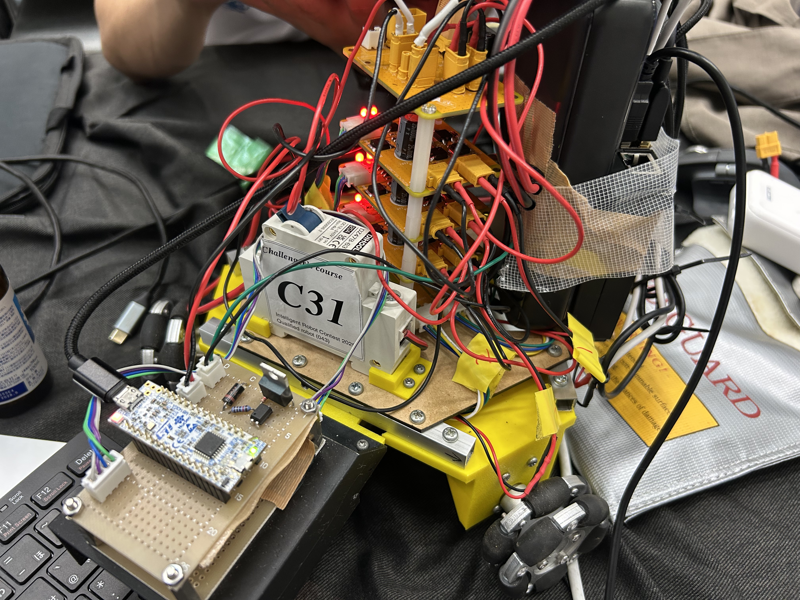
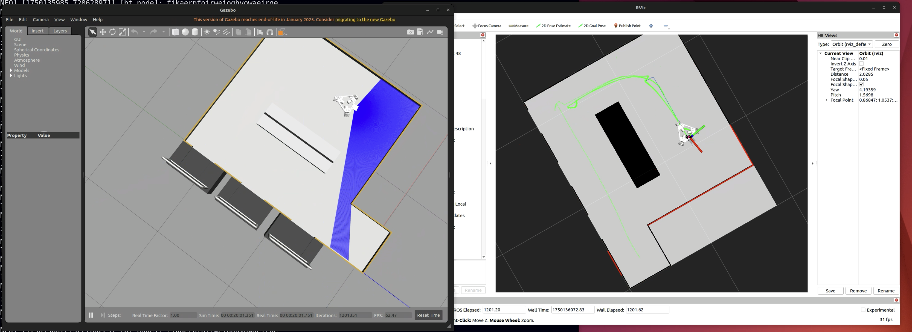

# inrof2025_ros

# Hardware


## Component
- Motor
- Omuni Wheel
- Lidar
- Motor Driver
- Microcomputer
- RaspberryPi 4B 8G
- Color sensor

# Software
Development was conducted using ROS 2 Humble on a Raspberry Pi. To minimize the use of physical hardware during experimentation, a simulation environment was built in Gazebo, and most of the software was developed within the simulation.


# install
## enviroment
- ubuntu22.04 LTS

## computational resources
### simulation env
- Corei7 14700F
- 32GB
- RTX4070 super

## ros2 humble install
[offical install guide](https://docs.ros.org/en/humble/Installation/Ubuntu-Install-Debs.html)

set `source /opt/ros/humble/setup.zsh` to `~/.zshrc`
```zsh
echo 'source /opt/ros/humble/setup.zsh' >> ~/.zshrc
```

create ros2 workspace and clone this repository
```bash
cd 
mkdir ros_ws/src
cd ros_ws/src
git clone git@github.com:keigo1216/inrof2025_ros.git
```

[install rosdep](https://docs.ros.org/en/humble/Tutorials/Intermediate/Rosdep.html)
```bash
sudo apt-get install python3-rosdep
```
```bash
sudo rosdep init
rosdep update
```

when execute on simulator (not on raspberrypi), set `WITH_SIM` to `1`
``` bash
export WITH_SIM=1 
```

install opencv
```bash
sudo apt install libopencv-dev
```

setup ld19
```bash
cd ~/ros_ws/src/
git clone https://github.com/keigo1216/ldrobot-lidar-ros2
cd ldrobot-lidar-ros2
git checkout humble
```
```bash
sudo apt install libudev-dev
```
```bash
cd ~/ros_ws/src/ldrobot-lidar-ros2/scripts/
./create_udev_rules.sh
```
```bash
cd ~/ros_ws/
rosdep install --from-paths src --ignore-src -r -y
colcon build --symlink-install --cmake-args=-DCMAKE_BUILD_TYPE=Release
```

install dependency
```bash
rosdep install --from-paths src -y --ignore-src
```

[install colcon](https://docs.ros.org/en/humble/Tutorials/Beginner-Client-Libraries/Colcon-Tutorial.html)

```bash
sudo apt install -y python3-colcon-common-extensions
```

install BehaviorTree4.8
```bash
sudo apt install libzmq3-dev libboost-dev qtbase5-dev libqt5svg5-dev libzmq3-dev libdw-dev
cd
git clone https://github.com/BehaviorTree/BehaviorTree.CPP.git
cd BehaviorTree.CPP
mkdir build
cd build
cmake ..
make -j8
sudo make install
cd ros_ws
```

install gazebo (only in simulation)
```bash
sudo apt -y install gazebo
sudo apt install ros-humble-gazebo-*
```

# env settings
Set `ROS_DOMAIN_ID` for Distributed processing and restart ros2 demon
```bash
echo 'export ROS_DOMAIN_ID=1' >> ~/.bashrc
ros2 daemon stop
ros2 daemon start
```

replace `<your workspace directory>` to ros workspace directory. (`/home/keigo/ros_ws`)
```bash
echo 'export GAZEBO_MODEL_PATH=<your workspace directory>/install/inrof2025_ros/share/inrof2025_ros/models/:${GAZEBO_MODEL_PATH}' >> ~/.bashrc
```

# set ip address
```bash
echo 'export ROS_IP=192.168.0.180' >> ~/.bashrc
```

# build and launch
build
```bash
cd ros_ws
colcon build --packages-select inrof2025_ros
```
launch
```bash
source install/setup.zsh
ros2 launch inrof2025_ros simulation.launch.py
```

# control keyboard
```bash
ros2 run teleop_twist_keyboard teleop_twist_keyboard --ros-args --remap cmd_vel:=/cmd_vel
```